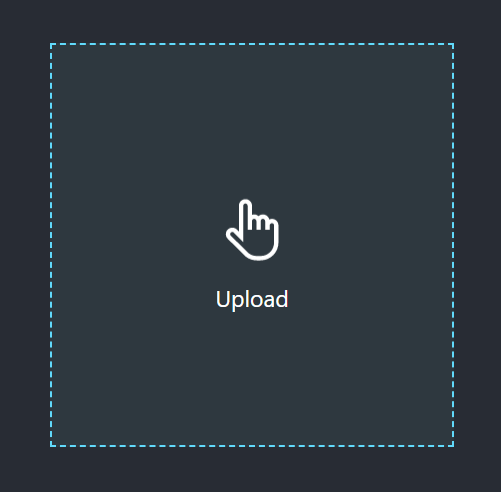
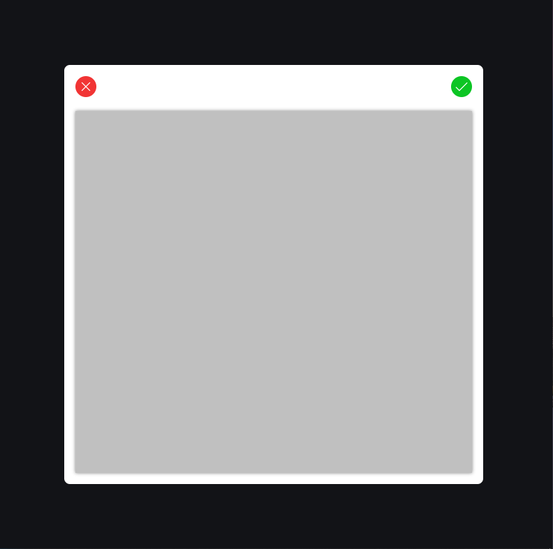
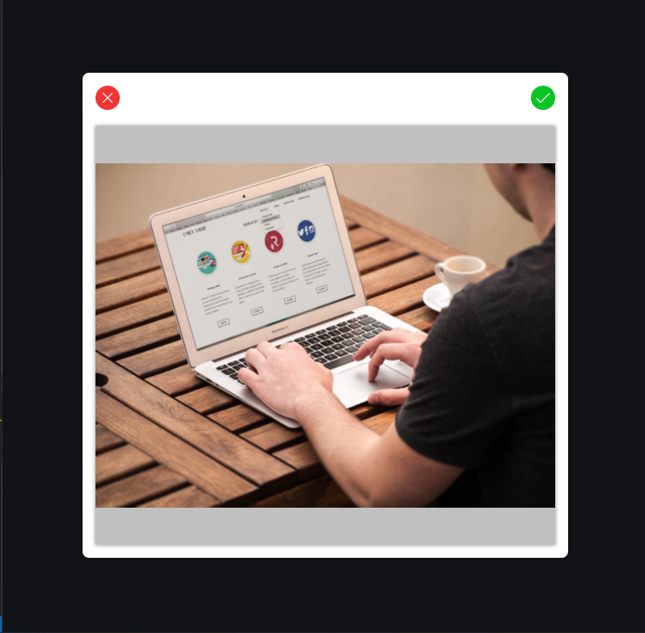
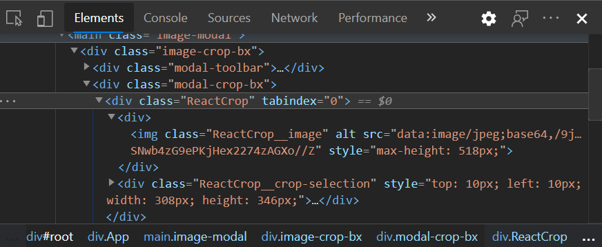

# 1. Let's Get Started
  As a user of your mobile or web app, I want to personalize my experience by including profile picture 😎 but the picture I want to use is too large and does not focus the part I wanted or I want to remove some part of the image. 
It will be nice to use the same app to crop the image to my taste! Right?

Apart from the editting part, we might need images of a particular width and height ratio (📝 we call this **aspect ratio**) in our apps for better image experience. 
In this article, we are going to create a simple image cropping system in React. Check out the result demo [here](https://Joshua0707.github.io/Image-Crop-In-React) . Great! Let's get started! 🚀.
 <br><br>

# 2. Prerequisites
  Yeah! Knowledge of Javascript, CSS and React is required. But if you are a beginner or intermediate with React and Javascript, why not join the train 🚆.

 <br><br>

# 3. Project Structure
  Let's create our React projects with our command line.
```bash
npm init react-app reactimagecrop
```
After our `reactimagecrop` project is loaded, we are left with a nice structure. We won't need some files like `logo.svg` and the test files. I included `components` folder (which will hold the components we will use), `helper` folder for utilities files.  So, I am left with
* public
* src
  * components
  * helpers
  * app.js
  * app.css
  * index.js
  * index.css
  * serviceWorker.js

We will also use a react image cropping component, `ReactCrop`. You could check out it's documentation [here](https://www.npmjs.com/package/react-image-crop).
```bash
npm install ReactCrop
```
Take a peek at my package.json
```json
{
  "name": "image-cropping-in-react",
  
  "dependencies": {
    "@testing-library/jest-dom": "^4.2.4",
    "@testing-library/react": "^9.5.0",
    "@testing-library/user-event": "^7.2.1",
    "gh-pages": "^3.1.0",
    "react": "^16.13.1",
    "react-dom": "^16.13.1",
    "react-image-crop": "^8.6.6",
    "react-scripts": "3.4.3"
  },
  
}
```

This tutorial will in segments based on these tasks or should we call it todo?
- Creating and Styling the Upload Page
- Creating the Crop Modal Component
- Using the Crop Modal Component
- Making Image Preview from Upload Inputs
- Using the ReactImageCrop component
- Adding Custom Styles to ReactImageCrop
- Creating the Result Container
- Cropping the Image with Canvas
- Validating Upload Inputs

 <br><br>

# 4. Creating and Styling the Upload Page
We are creating this page in our `app.js` file. We have the react template code here, we don't need some elements and so we remove them. We are left with this.
```jsx
import React from 'react';
import './App.css';

function App() {
  return (
    <div className="App">

    </div>
  )
}

export default App;
```
So we include `input[type="file"]` tag for uploading files into the `div.upload-bx` container. We need this for our custom styling 🌈 for the upload.
```jsx
// ...
return (
  <div className="App">
    <div className="upload-bx">
      <input type="file" onInput={handleInput} accept="image/gif, image/jpeg, image/png, image/jpg" />
      <span>{ handUp }</span>
      <span>Upload</span>
    </div>
  </div>
)
...
```

I included a svg import from my project file. If you need this file check it in [here](https://github.com/Joshua0707/Image-Crop-In-React/blob/main/src/icon.js). Now we style in `app.css`. This is the trick! Since we're making our custom input file upload element, we use positioning to make the `input` fill the box and we reduce its opacity to 0. Then, the `input` is there but we can't see it.
```css
.App .upload-bx {
  width: 400px;
  height: 400px;
  /* to support 'absolute'ly positioned children */
  position: relative;
}

.App .upload-bx [type=file] {
  /* fill its parent */
  position: absolute;
  top: 0;
  left: 0;
  width: 100%;
  height: 100%;
  /* make invisible */
  opacity: 0;
  cursor: pointer;
}
```

You can style it to your taste 👌. This is what I got.
<br><br>

<br><br>
# 5. Creating the Crop Modal Component
We are making the crop component a modal. In the `components` folder, I have the `ImageCropModal.js` file. That's the crop modal component. For simplicity, we are making use of *React's class component*.
```jsx
class ImageCropModal extends React.Component {
  render() {
    return (
      <main className="image-modal">
        <div className="image-crop-bx">
          <div className="modal-toolbar">
              <span>{ times }</span>
              <span>{ check }</span>
          </div>
          <div className="modal-crop-bx"></div>
        </div>
      </main>
    )
  }
}

export default ImageCropModal;
```
Wow! We have a nest of containers. The `main.image-modal` fills the entire screen with a dark translucent background. `div.image-crop-bx` is the modal content, the container that houses most importantly the crop component. We have the `div.modal-toolbar` that houses icons for closing the modal, cancelling selection and the other for choosing crop selection. The `div.modal-crop-bx` houses the `ReactImageCrop` component we installed already via npm.

In the same folder `components` folder, I have `imagecropmodal.css` for styling. We import it in the `ImageCropModal.js` as the following.
```jsx
...
import './imagecropmodal.css';
...
```

Now, let's work on the styling for the modal component.
```css
.image-modal {
  /* Fills the screen */
  width: 100vw;
  height: 100vh;
  position: fixed;
  top: 0;
  z-index: 100;
  /* Set the dark translucent background */
  background-color: rgba(0, 0, 0, 0.555);
  /* Position direct children (.image-crop-bx) to center */
  display: grid;
  place-items: center;
}

.image-modal .image-crop-bx {
  width: 600px;
  height: 600px;
  /* align children in a column */
  display: flex;
  flex-flow: column nowrap;
  /* my styling */
  border-radius: 8px;
  background-color: white;
  padding: 1rem;
  box-sizing: border-box;
}

.image-crop-bx .modal-toolbar {
    display: flex;
    justify-content: space-between;
    align-items: center;
    margin-bottom: 20px;
    height: 30px;
    box-sizing: border-box;
}

.image-crop-bx .modal-toolbar span {
    background-color: black;
    width: 30px;
    height: 30px;
    border-radius: 50%;
    display: grid;
    place-items: center;
    cursor: pointer;
}

.image-crop-bx .modal-crop-bx {
    margin: auto;
    width: 100%;
    height: calc(100% - 50px);
    background-color: #c0c0c0;
}
```

You could do some other works on the styling regarding the toolbar's button colors and other criteria.
<br><br>

<br><br><br>

# 6. Using the Upload Modal Component
In the last section, we just created the Crop Modal Component. Time ⌛ to implement it. We want the crop modal to come up when we have selected an image. Let's use this logic. We have a `image-input` state variable initialized to `null`. When `image-input` is `null`, the modal is not rendered else the modal is rendered. We will also like to keep track of the file name and type. In `App.js`, we could do this
```jsx
// ...
function App() {
  const [ imageInput, setImageInput ] = React.useState(null); // initialised to null
  const [ fileProps, setFileProps ] = React.useState({ name: null, type: null });

  return (
    <div className="App">
    {
      imageInput ? ( {/* imageInput is not null */}
        <ImageCropModal></ImageCropModal>
      ) : ( {/* else */}
        <div className="upload-bx">
          <input type="file" />
          <span>{ handUp }</span>
          <span>Upload</span>
        </div>
      )
    } 
  );
}
```

Let's update this to be the selected file via our upload component. I created a `handleInput` function to do just that. The `onInput` event triggered as a selection is made in the input file gives an *event* parameter. It comprises of all information about the event occurred. The information will include the `target`, which is the element, (in this case the `input[type="file"]` element) the event occurred on. We could get the value of the input but for file type, we get the files selected by get its `files` attribute. We are in this tutorial selecting just one, the first one.
```jsx
// ...
function App() {
  // ...
  const handleInput = (e) => {
    const { name, type } = e.target.files[0];
    setImageInput(e.target.files[0]) //  getting the first selected file if multiple file is selected
    setFileProps({ name: name.replace(" ", "_"), type }); // getting the file infos
  }

  return (
    <div className="App">
    {/* ... */}
        <div className="upload-bx">
          <input type="file" onInput={handleInput} />
          <span>{ handUp }</span>
          <span>Upload</span>
        </div>
    {/* ... */}
    </div>
  );
}
```
 <br><br>

# 7. Making Image Preview from Upload Inputs
Until now, we just have the modal coming up when a file is selected and nothing else happens. Have you wondered how are files selected by input are displayed? especially without having uploaded it? Have you tried this before? Let me introduce you to what is called `base64`. `base64` is a binary-to-text encoding scheme. Read more on [here](https://attacomsian.com/blog/javascript-base64-encode-decode). It can be included in a *data URL*. That's what we need to preview the selected image.

We should be able to pass the selected file to the `ImageCropModal` component as props. Just after render, we should be able to display the preview.
```jsx
class ImageCropModal extends React.Component {
  constructor(props) {
      super(props);
      this.state = {
        imgSrc: null,
      }
  }
  componentDidMount() { // immediately after render
    // extract the file
    const { imageSrc } = this.props;
    const reader = new FileReader();
    reader.addEventListener("load", () => {
      // set the imgSrc state variable the result dataURL
      this.setState({ imgSrc: reader.result })
    }, false);
    // create a base64 image file
    reader.readAsDataURL(imageSrc);
  }

  render() {
    return (
      <main className="image-modal">
        {/* ... */}
        <div className="modal-crop-bx">
            {  ?  : <></> }
        </div>
          {/* ... */}
      </main>
    )
  }
}
```
<br><br>



<br><br>

Of course, you need to still the image to support images of various dimensions.
<br>
This is not what we are developing but what I'm driving at is how to preview images from files. This is what the `ReactImageCrop` components needs to display the images selected.

<br><br>

# 8. Using the ReactImageCrop component
Great Work! 💪 This is exactly half of our tasks. Instead of the `img` tag for preview, we want the `ReactImageCrop` component for cropping 🥂. 
```jsx
// ...
import ReactImageCrop from 'react-image-crop';
import 'react-image-crop/dist/ReactCrop.css'; // don't forget the css

class ImageCropModal extends React.Component {
  // ...
  render() {
    return (
      <main className="image-modal">
        {/* ... */}
        <div className="modal-crop-bx">
            <ReactImageCrop src={this.state.imgSrc} />
        </div>
          {/* ... */}
      </main>
    )
  }
}
```

`ReactImageCrop` takes more than `src`. Check its documentation [here](https://www.npmjs.com/package/react-image-crop). It accepts many *props*. We will use few of them.
- `crop` is very much required. It defined the cropping dimension on the image. It states the initial crop (x, y, width, height), unit for cropping (default is 'px', it can also be '%') or aspect ratio (the rule for image cropping width-height ratio).
  ```js
  crop: {
    unit: 'px', // default, can be 'px' or '%'
    x: 130,
    y: 50,
    width: 200,
    height: 200
  }
  // or
  crop: {
    // you can either omit width and height
    aspect: 16 / 9,
    width: 50,
    unit: '%'
  }
  ```
- `onChange(crop, percentageCrop)` is a required props. It happens for every change of the crop
- `onComplete(crop, percentageCrop)` happens for every crop completed. It is optional.
- `onImageLoaded(image)` is the callback which happens when the image is loaded. It passes the image DOM element as parameter. We are to return false if we are setting crop in this callback;
- `onImageError(error)` is the callback which fires whens an error occurs during loading.

<br>
The first thing we will do is to create the handlers for the `ReactImageCrop` props. The crop will be set in the state.

```jsx
class ImageCropModal extends React.Component {
    constructor(props) {
        super(props);
        this.state = {
            imgSrc: null,
            crop: {
                unit: 'px'
            }
        }
    }
```

I didn't set the width or height because we are supporting different images dimensions and our custom dimension in pixels migt not go quite well. We are doing that in the `onImageCrop` handler. In the `ImageCropModal` class, add the following function.

```jsx
handleOnImageLoaded = (image) => {
  this.setImageRef(image);
  this.imageRef.style.maxHeight = this.cropContainer.current.getBoundingClientRect().height + 'px';
  this.setState({
      crop: { 
          height: image.height - 20, 
          width: image.width - 20, 
          unit: "px",
          x: 10,
          y: 10
      }
  });
  return false; // as we are setting props
}
```

Next, we are creating the handler function for image loading error.
```jsx
handleOnImageError = (error) => {
  console.log("could not load image")
  // handle error
}
```

After, the image is loaded, we can now have the cropping system ready and handle crop change and completion.
```jsx
handleOnCropChange = (pixelCrop, percentCrop) => {
  this.setState({ crop: pixelCrop })
}

handleOnCropComplete = (pixelCrop, percentCrop) => {
  this.setState({ crop: pixelCrop })
}
```
For this tutorial, we are using the pixel crop value and not the percent crop value. Let's attach these handlers to their appropriate `ReactImageCrop` props.
```jsx
<ReactImageCrop 
  src={this.state.imgSrc} 
  crop={this.state.crop}
  onImageLoaded={this.handleOnImageLoaded}
  onImageError={this.handleOnImageError}
  onChange={this.handleOnCropChange}
  onComplete={this.handleOnCropComplete} />
```
<br><br>

# 9. Adding Custom Styles to ReactImageCrop
There are suppose two ways of creating custom styles.
1. Duplicating the `react-image-crop/dist/ReactCrop.css` file into another custom css file and changing the styles. You will link this file instead of the default `react-image-crop/dist/ReactCrop.css`.
2. Knowing the classes and extending the styles in your css file.

I prefer the second one as I won't like to alter any other thing except the element I want to style. This is the order of the elements nested in the `ReactCropImage` component.
<br><br>

<br><br>

Directly from my `imagecropmodal.css` file, I can style the `ReactImageCrop` !
```css
.image-crop-bx .modal-crop-bx .ReactCrop {
  /* your style */
}
.image-crop-bx .modal-crop-bx .ReactCrop .ReactCrop__image {
  /* Your style */
}
.image-crop-bx .modal-crop-bx .ReactCrop .ReactCrop__crop-selection {
  /* Your style */
}
```

All I want to style is the `.ReactCrop` element to support various images. So I styled only that.

```css
.image-crop-bx .modal-crop-bx .ReactCrop {
    max-width: 100%;
    max-height: 100%;
}
```
<br><br>

# 10. Creating the Result Container
From the [demo](https://Joshua0707.github.io/Image-Crop-In-React), the result container should be something like
<br><br>

<br><br>
Let's optimize the code in `App.js` to include the result container;
```jsx
function App () {
  // ...
  const canvasRef = React.useRef(null);
  const [ showCanvas, setShowCanvas ] = React.useState(false);
  
  const uploadBox = (
    <div className="upload-bx">
      <input type="file" onInput={handleInput} accept="image/gif, image/jpeg, image/png, image/jpg" />
      <span>{ handUp }</span>
      <span>Upload</span>
    </div>
  );

  const ImageCropModalBox = (
    <ImageCropModal 
      imageSrc={imageInput}
      canvasRef={canvasRef}
      onExit={handleModalExit}
      onCropResult={handleCropResult} ></ImageCropModal>
  )

  return (
    <div className="App">
    {
      !showCanvas ? (imageInput ? ImageCropModalBox : uploadBox) : ''
    } 
    <div className={`result-bx ${showCanvas ? 'show' : ''}`}>
      <div><canvas ref={canvasRef}></canvas></div>
      <div className="crop-util"> 
        <button onClick={() => {
          setShowCanvas(false);
          setFileProps({ name: null, type: null })
        }}>clear</button>
        <span>{ download }</span>
        <span>{ file }</span>
      </div>
    </div>
    </div>
  );
}
```

Nothing really hard up there. I created `showCanvas` state to define when the result container should be shown. I am using css's display `none` and `flex` to toggle visibility because I actually want the canvas to be rendered for use in the `ImageCropModal` component. For better readability, I made the `uploadBox` and the `ImageCropModalBox` variables to hold the upload container and the modal container respectively. The `ImageCropModal` components takes the `imageSrc`, `canvasRef` DOM element for displaying result, `onExit` handler and `onCropResult` callback. Let implements the props.

We already have the imageSrc and the canvasRef from the result container. the `onExit` handles the mechanism to exit the modal. Remember that the modal comes up when the `imageInput` state is not null. To close the modal, we have to set it to null.
```jsx
const handleModalExit = () => {
  setImageInput(null)
}
```

Simple as that! The `onCropResult` handles the mechanism to bring up the result container. This is done by setting the `showCanvas` state variable to `true`. The props gives boolean, if error occured `false` else `true`, as parameter.
```jsx
const handleCropResult = (bool) => {
  setShowCanvas(bool)
}
```

We have already attached these handlers to the modal component's props. Having these props in the modal's components, It's time we put them to use. In the `ImageCropModal` component, we create functions to close and handle result.
```jsx
handleCropApproval = () => {
  // create result
  this.props.onCropResult(true);
  this.handleExit(); // exit the modal
}

handleExit = () => {
  this.props.onExit()
}
```

The best place to fire these handlers is the button to close modal and confirm cropping.
```jsx
<div className="modal-toolbar">
  <span onClick={this.handleExit}>{ times }</span>
  <span onClick={this.handleCropApproval}>{ check }</span>
</div>
```
We have the result container setup.
<br><br>

# 11. Cropping the Image with Canvas
The `canvas` element is very suitable to crop image. We already have the canvas passed to the modal. But how do we crop? We've created the `helpers` folder in our project directory, let's create a file `imagecrophelper.js` to help crop the image. In this file, I created a named export `imagetoCanvas(canvasRef, image, pixelCrop)` to do the cropping.
```js
export function imagetoCanvas(canvasRef, image, pixelCrop) {
  const canvas = canvasRef;
  // create scale X and Y
  const scaleX = image.naturalWidth / image.width;
  const scaleY = image.naturalHeight / image.height;
  // set canvas dimension
  canvas.width = pixelCrop.width;
  canvas.height = pixelCrop.height;
  // draw the cropped part
  const ctx = canvas.getContext('2d');
  ctx.drawImage(
    image,
    pixelCrop.x * scaleX,
    pixelCrop.y * scaleY,
    pixelCrop.width * scaleX,
    pixelCrop.height * scaleY,
    0,
    0,
    pixelCrop.width,
    pixelCrop.height
  )
}
```

That will do the work. In the `ImageCropModal` component, we just update the `handleCropApproval` function to use the helper function.
```jsx
handleCropApproval = () => {
  // get the canvas from the props
    const { canvasRef } = this.props;
    if (canvasRef && canvasRef.current) {
        imagetoCanvas(canvasRef.current, this.imageRef, this.state.crop)
        this.props.onCropResult(true); // no error
    } else { 
      this.props.onCropResult(false); // error
    }
    this.handleExit();
}
```
By the way, we have to import the helper functions.
```jsx
import { imagetoCanvas } from '../helpers/imagehelper';
```

We have that done! After, cropping the file, we will like to download it. Still using the `imagehelper.js` helper file, we create a named export function `downloadImage`.
```js
export function downloadImage (imageData, filename) {
  var element = document.createElement('a')
  element.setAttribute('href', imageData)
  element.setAttribute('download', filename)
  element.style.display = 'none'
  document.body.appendChild(element)
  element.click()
  document.body.removeChild(element)
}
```
What's up there is no hard. We created an invisible `anchor` element for download, virtually click it! and remove it. Let's use it in our `App.js` and setup the click handlers for download
```jsx
function App () {
  // previous codes ...
  return (
    <div className="App">
      {/* ... */}
      <span onClick={handleFileDownload}>{ download }</span>
      <span onClick={consoleLogFile}>{ file }</span>
      {/* ... */}
    <div>
  )
}
```

let's create the functions.
```jsx
const handleFileDownload = () => {
  if (fileProps && (fileProps.name && fileProps.type)) {
    // get the image data from the canvas
    const imageData = canvasRef.current.toDataURL(fileProps.type);
    /*
    The file type is like "image/jpeg"
    to extract the "jpeg", we split and select the second index
    - fileProps.type.split("/")[1]
    */
   // composing the file name
    const fileName = `${fileProps.name}.${fileProps.type.split("/")[1]}`;
    // downloadImage helper function
    downloadImage(imageData, fileName)
  }
}
```

You might want to use cropped image in another way in your personal projects. So, I added the second function `consoleLogFile` triggered by the second button in the result container. We are just console logging the file. In real life, you might want to upload to a server or something else. Let's implement it in our `App` component!

```jsx
if (fileProps && (fileProps.name && fileProps.type)) {
  // get the image data from the canvas
  const imageData = canvasRef.current.toDataURL(fileProps.type);
  const fileName = `${fileProps.name}.${fileProps.type.split("/")[1]}`;
  // create the file from our helper function
  const newFile = imagetoFile(imageData, fileName);
  console.log(newFile)
}
```

We don't have this `imagetoFile` function yet, In our `imagehelper.js` add this function.
```js
export function imagetoFile (base64String, filename) {
  var arr = base64String.split(','), mime = arr[0].match(/:(.*?);/)[1],
    bstr = atob(arr[1]), n = bstr.length, u8arr = new Uint8Array(n)
  while (n--) {
    u8arr[n] = bstr.charCodeAt(n)
  }
  return new File([u8arr], filename, {type: mime})
}
```

# 12. Validating Upload Inputs
All is set but on thing is important, validation! The `input[type=file]` tag for upload is like
```html
<input type="file" onInput={handleInput} accept="image/gif, image/jpeg, image/png, image/jpg" />
```
The accept attribute defined the files uploadable but that doesn't validate it all. We have to control this in the input handler function, `handleInput`. We could modify this to 
```jsx
const handleInput = (e) => {
  const { name, type } = e.target.files[0];
  const supportedFormats = ['image/jpg','image/gif','image/png', 'image/jpeg'];
  let file = (e.target.files ? e.target.files[0] : e.target.value || undefined);

  if (file && file.type) {
    if (supportedFormats.indexOf(file.type) < 0) {
      alert('Only Images Supported!');
    }
    else {
      setImageInput(e.target.files[0])
      setFileProps({ name: name.replace(" ", "_"), type })
    }
  }
}
```
Voila! We have our Image Upload-Crop System in React. Thanks to `ReactImageCrop`! Hopefully, this guide helped your project that needs cropping of images or even encouraged you to add cropping to your project!